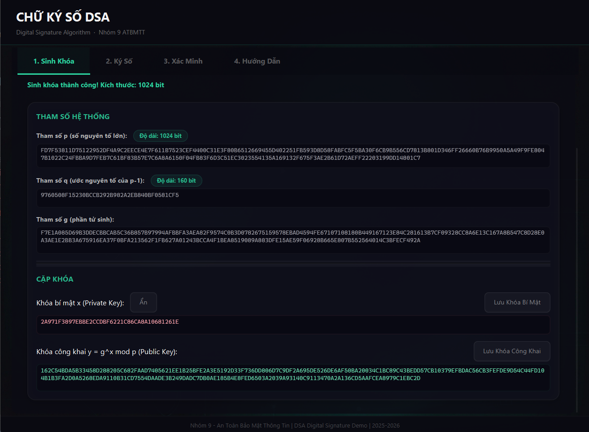

# 🔐 Chữ Ký Số DSA — Digital Signature Algorithm

> **Nhóm 9 · Môn An Toàn Bảo Mật Thông Tin (ATBMTT)**
> Phiên bản cải tiến · Khóa học 2025–2026

Ứng dụng desktop JavaFX minh họa đầy đủ quy trình **Sinh khóa → Ký số → Xác minh** của thuật toán chữ ký số DSA, sử dụng Java Cryptography Architecture (JCA).

---

## 📋 Mục Lục

- [Giới Thiệu](#-giới-thiệu)
- [Tính Năng](#-tính-năng)
- [Ảnh Chụp Màn Hình](#-ảnh-chụp-màn-hình)
- [Kiến Trúc Dự Án](#-kiến-trúc-dự-án)
- [Yêu Cầu Hệ Thống](#-yêu-cầu-hệ-thống)
- [Cài Đặt & Chạy](#-cài-đặt--chạy)
- [Hướng Dẫn Sử Dụng](#-hướng-dẫn-sử-dụng)
- [Cơ Sở Lý Thuyết DSA](#-cơ-sở-lý-thuyết-dsa)
- [Công Nghệ Sử Dụng](#-công-nghệ-sử-dụng)
- [Thành Viên Nhóm](#-thành-viên-nhóm)

---

## 🎯 Giới Thiệu

**DSA (Digital Signature Algorithm)** là thuật toán chữ ký số được chuẩn hóa bởi NIST (FIPS 186), dựa trên bài toán **Logarit rời rạc** (Discrete Logarithm Problem — DLP). Ứng dụng này cung cấp giao diện trực quan để:

- Hiểu rõ từng bước hoạt động của DSA
- Thực hành sinh khóa, ký số và xác minh chữ ký
- Quan sát các tham số toán học (p, q, g, x, y, r, s) trong thời gian thực

---

## ✨ Tính Năng

### Tab 1 — Sinh Khóa
| Tính năng | Mô tả |
|---|---|
| Chọn kích thước khóa | Hỗ trợ **1024-bit** và **2048-bit** |
| Sinh cặp khóa DSA | Tạo tham số hệ thống (p, q, g) và cặp khóa (x, y) |
| Hiện/Ẩn khóa bí mật | Bảo vệ khóa bí mật x bằng dấu chấm tròn (●), nhấn để hiển thị |
| Hiển thị bit-length | Xác nhận độ dài bit thực tế của p và q |
| Lưu khóa ra file | Xuất khóa bí mật / công khai thành file `.txt` hoặc `.key` |

### Tab 2 — Ký Số
| Tính năng | Mô tả |
|---|---|
| Nhập thông điệp | Nhập trực tiếp hoặc tải từ file |
| Ký bằng SHA256withDSA | Băm SHA-256 + ký DSA, kết quả dạng Base64 DER |
| Tách chữ ký (r, s) | Bóc tách thành phần toán học r và s (Hex + Decimal) |
| Sao chép thông điệp | Copy nhanh nội dung thông điệp vào clipboard |
| Sao chép / Lưu chữ ký | Copy hoặc lưu chữ ký thành file `.sig` |
| Nạp khóa bí mật | Tải file khóa bí mật đã lưu từ trước |

### Tab 3 — Xác Minh
| Tính năng | Mô tả |
|---|---|
| Nạp khóa công khai | Tải file khóa công khai hoặc dùng khóa vừa sinh |
| Nhập thông điệp & chữ ký | Nhập trực tiếp hoặc tải từ file |
| Sao chép thông điệp | Copy nhanh nội dung thông điệp xác minh vào clipboard |
| Xác minh chữ ký | Kiểm tra tính hợp lệ với hiệu ứng animation trực quan |
| Thông báo lỗi chi tiết | Phát hiện sai Base64, sai cấu trúc DER, hoặc chữ ký không khớp |

### Tab 4 — Hướng Dẫn
- Giải thích DSA là gì
- Hướng dẫn từng bước sử dụng ứng dụng
- Lưu ý quan trọng về tính toàn vẹn dữ liệu

### Giao Diện Premium
- 🎨 Thiết kế tối (Dark Theme) với bảng màu Emerald `#2dd4a0`
- 💎 Hiệu ứng Glassmorphism trên các card và surface
- ✨ Animations mượt mà: slide-in, fade-in, overshoot bounce
- 🎯 Nút bấm có phản hồi xúc giác (tactile press feedback)

---

## 📸 Ảnh Chụp Màn Hình

<p align="center">
  
  <br>
  <em>Giao diện premium (Dark Theme - Emerald Accent) với các thông số chi tiết của thuật toán DSA</em>
</p>

---

## 🏗 Kiến Trúc Dự Án

Dự án tuân theo mô hình **MVC (Model – View – Controller)**:

```
java/
├── pom.xml                                        # Maven project config
├── README.md                                      # File này
│
└── src/main/
    ├── java/com/nhom9/atbmtt/
    │   ├── DSAApplication.java                    # Entry point — khởi tạo Stage & Scene
    │   ├── DSAController.java                     # Controller — xử lý sự kiện UI
    │   └── DSAModel.java                          # Model — logic thuật toán DSA (JCA)
    │
    └── resources/
        ├── css/
        │   └── style.css                          # Stylesheet — Dark Emerald theme
        ├── fxml/
        │   └── main_view.fxml                     # Layout giao diện FXML
        └── images/
            └── background.png                     # Ảnh nền cryptography theme
```

### Luồng Dữ Liệu

```
┌─────────────────┐     sự kiện     ┌──────────────────┐     gọi API     ┌──────────────┐
│   main_view     │ ──────────────► │  DSAController   │ ──────────────► │   DSAModel   │
│   (FXML View)   │                 │  (Controller)    │                 │   (Model)    │
│                 │ ◄────────────── │                  │ ◄────────────── │              │
└─────────────────┘   cập nhật UI   └──────────────────┘   trả kết quả   └──────────────┘
```

---

## 💻 Yêu Cầu Hệ Thống

| Thành phần | Phiên bản tối thiểu |
|---|---|
| **Java JDK** | 25 trở lên (Khuyên dùng JDK 26.0.1 như cấu hình máy) |
| **JavaFX** | 21.0.2 (tự tải qua Maven) |
| **Maven** | 3.8+ (hoặc dùng IntelliJ tích hợp) |
| **OS** | Windows / macOS / Linux |

---

## 🚀 Cài Đặt & Chạy

### Cách 1: Sử dụng IntelliJ IDEA (Khuyên dùng)

1. **Mở project** — File → Open → chọn thư mục `java/`
2. **Đợi Maven tải dependencies** — IntelliJ sẽ tự động tải JavaFX
3. **Chạy ứng dụng** — Click phải vào `DSAApplication.java` → Run

### Cách 2: Sử dụng Maven CLI

```bash
# Clone hoặc tải về project
cd java/

# Biên dịch
mvn compile

# Chạy ứng dụng
mvn javafx:run
```

### Cách 3: Build JAR

```bash
mvn package
java -jar target/dsa-demo-1.0-SNAPSHOT.jar
```

---

## 📖 Hướng Dẫn Sử Dụng

### Bước 1 — Sinh Khóa

1. Vào **Tab 1: Sinh Khóa**
2. Chọn kích thước khóa: `1024 bit` (nhanh) hoặc `2048 bit` (an toàn hơn)
3. Nhấn **Sinh Khóa** — hệ thống sẽ tạo:
   - Tham số hệ thống: `p`, `q`, `g`
   - Khóa bí mật: `x` (ẩn mặc định)
   - Khóa công khai: `y = g^x mod p`
4. *(Tùy chọn)* Nhấn **Lưu Khóa Bí Mật** / **Lưu Khóa Công Khai** để xuất file

### Bước 2 — Ký Số Thông Điệp

1. Vào **Tab 2: Ký Số**
2. Nhập thông điệp hoặc tải từ file
3. Nhấn **Ký Số** → nhận chữ ký Base64 DER
4. *(Tùy chọn)* Nhấn **Tách Chữ Ký (r, s)** để xem thành phần toán học
5. Nhấn **Sao Chép Chữ Ký** hoặc **Lưu Chữ Ký** để lưu lại kết quả
6. Nhấn **Sao Chép** (cạnh trường thông điệp) để copy nội dung thông điệp

### Bước 3 — Xác Minh Chữ Ký

1. Vào **Tab 3: Xác Minh**
2. Tải khóa công khai (hoặc dùng khóa vừa sinh ở Tab 1)
3. Nhập/dán thông điệp gốc và chữ ký số
4. Nhấn **Xác Minh**:
   - ✅ **Hợp lệ** — vòng tròn xanh lá + thông báo thành công
   - ❌ **Không hợp lệ** — vòng tròn đỏ + thông báo lỗi chi tiết

> ⚠️ **Lưu ý:** Thay đổi dù chỉ **1 ký tự** (kể cả khoảng trắng, xuống dòng) trong thông điệp sẽ làm chữ ký trở nên không hợp lệ. Đây chính là đặc tính **tính toàn vẹn** của chữ ký số.

---

## 📐 Cơ Sở Lý Thuyết DSA

### Tham Số Hệ Thống

| Ký hiệu | Mô tả | Kích thước |
|---|---|---|
| `p` | Số nguyên tố lớn | 1024 / 2048 / 3072 bit |
| `q` | Ước nguyên tố của (p − 1) | 160 / 224 / 256 bit |
| `g` | Phần tử sinh, g = h^((p−1)/q) mod p | — |

### Sinh Khóa

```
Chọn x ngẫu nhiên:  0 < x < q         (khóa bí mật)
Tính y:             y = g^x mod p      (khóa công khai)
```

### Quy Trình Ký

```
1. Băm thông điệp:   H(m) = SHA-256(message)
2. Chọn k ngẫu nhiên: 0 < k < q
3. Tính r:            r = (g^k mod p) mod q
4. Tính s:            s = k⁻¹ · (H(m) + x·r) mod q
5. Chữ ký:            σ = (r, s)
```

### Quy Trình Xác Minh

```
1. Tính w:   w  = s⁻¹ mod q
2. Tính u₁:  u₁ = H(m) · w mod q
3. Tính u₂:  u₂ = r · w mod q
4. Tính v:   v  = (g^u₁ · y^u₂ mod p) mod q
5. Kết luận: Chữ ký hợp lệ ⟺ v == r
```

### Tính Chất Bảo Mật

- **Tính xác thực (Authentication):** Chỉ người sở hữu khóa bí mật x mới có thể tạo chữ ký hợp lệ
- **Tính toàn vẹn (Integrity):** Bất kỳ thay đổi nào trên thông điệp sẽ khiến chữ ký không còn hợp lệ
- **Chống chối bỏ (Non-repudiation):** Người ký không thể phủ nhận việc đã ký thông điệp

> ⚠️ **Quan trọng:** Giá trị `k` phải được sinh ngẫu nhiên cho **mỗi lần ký** và không bao giờ được tái sử dụng. Nếu `k` bị lộ hoặc trùng lặp, kẻ tấn công có thể khôi phục khóa bí mật `x`.

---

## 🛠 Công Nghệ Sử Dụng

| Công nghệ | Vai trò |
|---|---|
| **Java 25 / 26** | Ngôn ngữ chính (Source level 25, chạy trên JDK 26) |
| **JavaFX 21** | Framework giao diện desktop |
| **FXML** | Định nghĩa layout giao diện (tách biệt View) |
| **JavaFX CSS** | Tùy chỉnh giao diện Dark Emerald theme |
| **Java Cryptography Architecture (JCA)** | Thư viện mật mã chuẩn (DSA, SHA-256) |
| **Maven** | Quản lý dependencies & build |

---

## 👥 Thành Viên Nhóm

| Thành viên | Vai trò |
|---|---|
| **Long** | Phát triển & Thiết kế |
| **Vi** | Phát triển & Thiết kế |

---

<p align="center">
  <strong>Nhóm 9 — Môn An Toàn Bảo Mật Thông Tin</strong><br>
  <em>Khóa học 2025–2026</em>
</p>
